<!-- ═══════════════════════════ HEADER ═══════════════════════════ -->

<picture>
  <source media="(prefers-color-scheme: dark)" srcset="assets/banner-dark.gif?v=2" />
  <source media="(prefers-color-scheme: light)" srcset="assets/banner-light.gif?v=2" />
  
</picture>

 

## 💫 Who am I?

I'm a **self-directed developer** building intelligent systems that run themselves.

I learn by building — shipping working code, testing it under real conditions, then **automating anything I shouldn't have to do twice**.

Right now that's a **fully automated e-commerce platform**, built end to end on open-source tooling, **React**, and **AI embeddings**.

<picture>
  <source media="(prefers-color-scheme: dark)" srcset="assets/terminal-dark.gif?v=2" />
  <source media="(prefers-color-scheme: light)" srcset="assets/terminal-light.gif?v=2" />
  
</picture>

## 📡 Live snapshot

<!-- Everything between these markers is rewritten by .github/workflows/profile.yml.
     Don't hand-edit it — your changes get overwritten on the next run. -->
<!-- SNAPSHOT:START -->
| | | |
|:--|:--|:--|
| **10** repositories | **34** commits this year | **56** contributions |
| **0** day streak | **2** day best | **15** months building |
| **0** stars | **2** followers | **2** PRs |
<!-- SNAPSHOT:END -->

**Most used:** <!-- LANGS:START -->
**Jupyter Notebook** 90% &#183; **HTML** 5% &#183; **Python** 3% &#183; **JavaScript** 1%
<!-- LANGS:END -->

## 🎯 Current Focus

| | Objective | Status | What that means |
| :---: | :--- | :---: | :--- |
| 🖥️ | **Front-End** | 🔥 `Active` | Building production interfaces with React, Bootstrap, and modern UI fundamentals. |
| 🤖 | **AI & Automation** | 🚀 `Exploring` | Working with n8n, embeddings, and agentic workflows to remove manual steps from real processes. |
| 🛒 | **E-Commerce** | 🏗️ `Building` | A self-operating storefront, architected entirely on open-source tooling. |

> 💡 **How I work:** Everything here is self-directed. I build first and read second — documentation lands far better once you've already had to make something work.

## 🛠️ Tech Stack & Tools

 

<picture>
  <source media="(prefers-color-scheme: dark)" srcset="assets/ticker-dark.gif" />
  <source media="(prefers-color-scheme: light)" srcset="assets/ticker-light.gif" />
  
</picture>

<picture>
  <source media="(prefers-color-scheme: dark)" srcset="assets/skills-dark.svg?v=1" />
  <source media="(prefers-color-scheme: light)" srcset="assets/skills-light.svg?v=1" />
  
</picture>

<b>👇 Click to expand the full stack</b>

 

**🖥️ Front-End & UI**

**⚙️ Backend & Data**

**🤖 AI & Data Science**

…plus **NumPy**, **embeddings & vector search**, and **n8n** for agentic workflows.

**🚀 DevOps & Tools**

**🎮 Game Development — personal projects**

Design side: **Canva**, for the work that has to look right before it works.

## 📊 GitHub Metrics

These cards are generated by a workflow in this repository and served from `assets/` — no third-party rendering service to rate-limit or go down.

<!-- CARDS:START -->

<picture>
  <source media="(prefers-color-scheme: dark)" srcset="assets/stats-dark.svg?v=10cf9a90" />
  <source media="(prefers-color-scheme: light)" srcset="assets/stats-light.svg?v=137cee7d" />
  
</picture>
<picture>
  <source media="(prefers-color-scheme: dark)" srcset="assets/langs-dark.svg?v=ac87f3c8" />
  <source media="(prefers-color-scheme: light)" srcset="assets/langs-light.svg?v=86235f0a" />
  
</picture>

<picture>
  <source media="(prefers-color-scheme: dark)" srcset="assets/streak-dark.svg?v=6ed5da69" />
  <source media="(prefers-color-scheme: light)" srcset="assets/streak-light.svg?v=f80f289e" />
  
</picture>
<picture>
  <source media="(prefers-color-scheme: dark)" srcset="assets/trophies-dark.svg?v=d5ebfa55" />
  <source media="(prefers-color-scheme: light)" srcset="assets/trophies-light.svg?v=597a215e" />
  
</picture>

<picture>
  <source media="(prefers-color-scheme: dark)" srcset="assets/heatmap-dark.svg?v=9214a30a" />
  <source media="(prefers-color-scheme: light)" srcset="assets/heatmap-light.svg?v=fcecd405" />
  
</picture>

<!-- CARDS:END -->

⚡ Live activity — rendered on demand by `github-readme-activity-graph`, refreshed on every push.

<picture>
  <source media="(prefers-color-scheme: dark)" srcset="https://github-readme-activity-graph.vercel.app/graph?username=boss2236&amp;bg_color=0A101F&amp;color=00C58E&amp;line=0083B0&amp;point=3ff0bd&amp;area_color=0e4f42&amp;radius=10&amp;hide_border=true" />
  <source media="(prefers-color-scheme: light)" srcset="https://github-readme-activity-graph.vercel.app/graph?username=boss2236&amp;bg_color=ffffff&amp;color=12203a&amp;line=00668C&amp;point=33b894&amp;area_color=c3ecdf&amp;radius=10&amp;hide_border=true" />
  
</picture>

🏔️ A 3D rendering of the contribution grid — rebuilt nightly by a workflow in this repository.

## 🐍 Contribution Snake

<picture>
  <source media="(prefers-color-scheme: dark)" srcset="https://raw.githubusercontent.com/boss2236/boss2236/output/snake-dark.svg" />
  <source media="(prefers-color-scheme: light)" srcset="https://raw.githubusercontent.com/boss2236/boss2236/output/snake-light.svg" />
  
</picture>

## ✍️ Thought of the Day

> *"Simplicity is the soul of efficiency."*
>
> **— Austin Freeman**

## 🌐 Connect & Support

### Let's build something

&nbsp;&nbsp;
&nbsp;&nbsp;
&nbsp;&nbsp;

  

### 💰 Support the work

If something I've built here saved you time, you're welcome to support the work.

 

  

<!-- UPDATED:START -->
Cards regenerated automatically &#183; last run **11 Aug 2026, 02:23 UTC**
<!-- UPDATED:END -->

